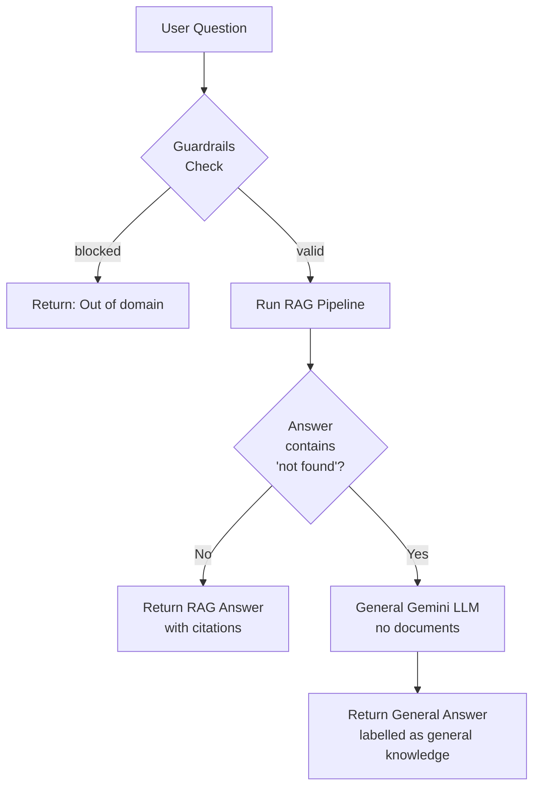

# Askra — Enterprise RAG Knowledge Assistant

---

## Overview

Askea is an advanced internal knowledge assistant that enables organizations to securely upload documents (PDFs, DOCX, PPTX, TXT) and ask natural language questions. It utilizes a **multi-stage Advanced RAG pipeline** to provide highly accurate, citation-backed answers grounded purely in the uploaded enterprise knowledge base.

## System Architecture

### Full-Stack Architecture Roles

The InsightFlow AI platform is built on a decoupled, scalable architecture separating the user interface from the heavy AI processing logic.

#### 🖥️ Frontend Role (React + Vite)
- **User Interface & Experience**: Provides a responsive, modern interface for employees, managers, and admins built with React 18, Tailwind CSS, and ShadCN UI.
- **State Management & Caching**: Uses React Query for efficient data fetching, caching, and background synchronization of chat history and analytics.
- **Real-Time Interactions**: Handles real-time streaming of LLM responses via Server-Sent Events (SSE) so users see answers generated token-by-token.
- **Data Visualization**: Renders interactive analytics dashboards using Recharts to visualize query trends and department activity.

#### ⚙️ Backend Role (FastAPI)
- **API Gateway**: Exposes highly concurrent, async RESTful endpoints for the frontend to interact with using FastAPI.
- **Security & RBAC**: Manages JWT-based authentication, verifying user permissions, and enforcing role-based access control (Admin, Manager, Employee) on every request.
- **Orchestration**: Serves as the central hub connecting the MongoDB metadata store, the local FAISS vector store, and external Gemini API.
- **Heavy Lifting (RAG Agent)**: Executes the advanced multi-stage RAG pipeline (Document extraction, hybrid retrieval, cross-encoder reranking, LLM answer generation) efficiently on the server.

### High-Level Overview

```text
╔══════════════════════════════════════════════════════════════════════╗
║                        RAG AGENT SYSTEM                             ║
╠══════════════════════╦═══════════════════════════════════════════════╣
║   INGESTION LAYER    ║              QUERY LAYER                     ║
║                      ║                                               ║
║  PDF/DOCX Files      ║   User Question                              ║
║      │               ║        │                                      ║
║      ▼               ║        ▼                                      ║
║  Text Extraction     ║   ① Dynamic Router ─(BLOCK)──→ Reject        ║
║  (Multi-format)      ║        │   └──(LLM)──→ General LLM Answer    ║
║      │               ║        ▼ (RAG)                                ║
║      ▼               ║   ② Query Rewriting (Gemini LLM)             ║
║  Chunking            ║        │                                      ║
║ (1000 char, 200 ovlp)║        ▼                                      ║
║      │               ║   ③ Hybrid Retrieval                         ║
║      ▼               ║   ┌──────────┬──────────┐                    ║
║  Embeddings          ║   │  FAISS   │   BM25   │                    ║
║  (text-embedding-004)║   │ semantic │ keyword  │                    ║
║      │               ║   └────┬─────┴─────┬────┘                    ║
║      ▼               ║        │  Fusion   │                          ║
║  FAISS Vector Store  ║        ▼ + Metadata Boost                    ║
║                      ║   ④ CrossEncoder Reranking                   ║
║                      ║        │                                      ║
║                      ║        ▼                                      ║
║                      ║   ⑤ Gemini Answer Generation                 ║
║                      ║        │                                      ║
║                      ║        ▼                                      ║
║                      ║   Answer + Source Citations                   ║
╚══════════════════════╩═══════════════════════════════════════════════╝
```


## Pipeline Deep Dive

### 1. Ingestion Pipeline

```text
Document File(s)
    │
    ▼
┌─────────────────────────────────────────┐
│         TEXT EXTRACTION                 │
│  • PyMuPDF (PDFs)                       │
│  • python-docx (Word docs)              │
│  • python-pptx (Presentations)          │
│  • Native Reader (TXT)                  │
└──────────────────┬──────────────────────┘
                   │
                   ▼
┌─────────────────────────────────────────┐
│         TEXT CLEANING                   │
│  • Remove headers/footers               │
│  • Normalize unicode & formatting       │
└──────────────────┬──────────────────────┘
                   │
                   ▼
┌─────────────────────────────────────────┐
│         CHUNKING ENGINE                 │
│  RecursiveCharacterTextSplitter         │
│  chunk_size    = 1000 chars              │
│  chunk_overlap = 200 chars              │
└──────────────────┬──────────────────────┘
                   │ chunks[ {text, metadata, department} ]
                   ▼
┌─────────────────────────────────────────┐
│         EMBEDDING GENERATION            │
│  Model: models/text-embedding-004       │
│  Dimension: 768                         │
└──────────────────┬──────────────────────┘
                   │
                   ▼
┌─────────────────────────────────────────┐
│         FAISS INDEX                     │
│  Filtered by Department Metadata        │
└─────────────────────────────────────────┘
```

### 2. Query Pipeline

```text
User Question: "What are penalties for data breach under DPDP Act?"
    │
    ▼
┌─────────────────────────────────────────────────────────────────┐
│  STEP 1 — DYNAMIC ROUTER & GUARDRAILS                           │
│  Layer 1: Check against static blocked patterns                 │
│  Layer 2: Fast match against extracted keywords                 │
│  Layer 3: Gemini assigns intent (BLOCK, LLM, or RAG)            │
└──────────────────────────────┬──────────────────────────────────┘
                               │ (If RAG)
                               ▼
┌─────────────────────────────────────────────────────────────────┐
│  STEP 2 — QUERY REWRITING (Gemini LLM)                          │
│                                                                 │
│  Input:  "penalties for data breach under DPDP Act"             │
│  Output: "penalties for data breach under Digital Personal      │
│           Data Protection Act 2023"                             │
└──────────────────────────────┬──────────────────────────────────┘
                               │ rewritten_query
                               ▼
┌─────────────────────────────────────────────────────────────────┐
│  STEP 3 — HYBRID RETRIEVAL                                      │
│                                                                 │
│  ┌──────────────────────┐    ┌──────────────────────┐           │
│  │   FAISS (semantic)   │    │    BM25 (keyword)    │           │
│  │                      │    │                      │           │
│  │  Cosine similarity   │    │  TF-IDF scoring      │           │
│  │  Top-10 results      │    │  Top-10 results      │           │
│  └──────────┬───────────┘    └───────────┬──────────┘           │
│             │                            │                      │
│             └────────────┬───────────────┘                      │
│                          ▼                                      │
│              WEIGHTED SCORE FUSION                              │
│              FAISS weight: 0.7                                  │
│              BM25  weight: 0.3                                  │
│                          │                                      │
│                          ▼                                      │
│              Top-10 unique merged candidates                    │
└──────────────────────────┬──────────────────────────────────────┘
                           │
                           ▼
┌─────────────────────────────────────────────────────────────────┐
│  STEP 4 — CROSSENCODER RERANKING                                │
│                                                                 │
│  Model: cross-encoder/ms-marco-MiniLM-L-6-v2                    │
│                                                                 │
│  Scores every (query, chunk_text) pair jointly                  │
│  10 candidates in → Top 5 out (ranked by relevance)             │
└──────────────────────────┬──────────────────────────────────────┘
                           │ Top-5 reranked chunks
                           ▼
┌─────────────────────────────────────────────────────────────────┐
│  STEP 5 — GEMINI ANSWER GENERATION                              │
│                                                                 │
│  Model: gemini-1.5-flash                                        │
│                                                                 │
│  Rules: cite sources, use ONLY context, don't hallucinate       │
│  Output: Answer + [Source: dpdp.pdf, Page: 21]                  │
└──────────────────────────┬──────────────────────────────────────┘
                           │
                           ▼
          {answer, sources[], num_sources, rewritten_query}
```

### 3. Smart Fallback Flow



---

## Tech Stack

| Component | Technology | Details |
|---|---|---|
| **Frontend** | React 18, Vite, Tailwind CSS, ShadCN | Modern UI with SSE streaming chat |
| **Backend Framework** | FastAPI (Python 3.11) | High-performance async API |
| **LLM & Embeddings** | Groq | Qwen 3.6 & text-embedding-004 |
| **Vector Store** | FAISS | Local scalable semantic search |
| **Keyword Search** | BM25 (`rank-bm25`) | Exact keyword matching |
| **Reranker** | HuggingFace Cross-Encoder | `ms-marco-MiniLM-L-6-v2` |
| **Document Parsers** | PyMuPDF, python-docx, etc. | Cascade fallback for robustness |
| **Database** | MongoDB | Stores metadata, users, chat history |
| **Auth** | JWT (Access + Refresh) | RBAC (Employee, Manager, Admin) |
?

groq_api_key = GROQ_API_KEY_REDACTED